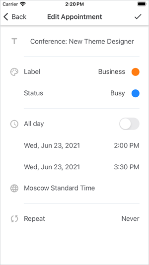
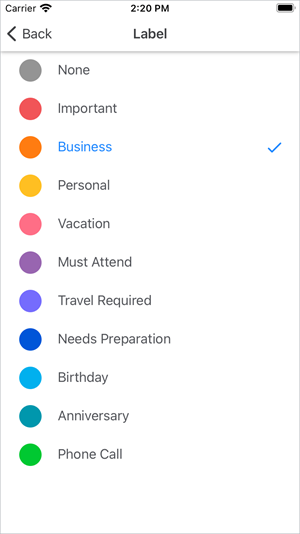
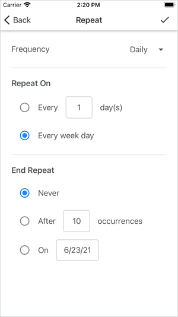
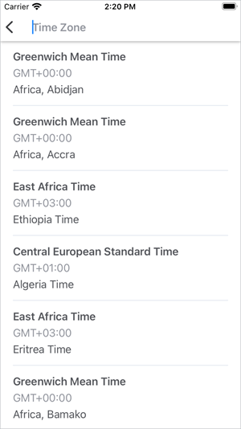
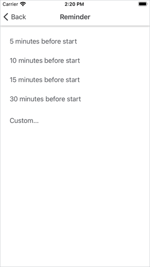

<!-- default badges list -->

<!-- default badges end -->
# Customize Edit Appointment Pages

The [DevExpress Xamarin.Forms Scheduler](https://docs.devexpress.com/MobileControls/400676/xamarin-forms/scheduler/index) has a set of built-in pages that allow users to schedule new events or edit existing appointments. 

This example’s [SchedulerPages](./CS/SchedulerExample/SchedulerPages) folder contains the source code of the [AppointmentDetailPage](https://docs.devexpress.com/MobileControls/DevExpress.XamarinForms.Scheduler.AppointmentDetailPage) and [AppointmentEditPage](https://docs.devexpress.com/MobileControls/DevExpress.XamarinForms.Scheduler.AppointmentEditPage) pages, including all pages invoked from these pages. You can reuse this code in your projects to customize the scheduler’s default edit-appointment [pages](#pages):
1. Copy the [SchedulerPages](./CS/SchedulerExample/SchedulerPages) folder to your project and rename namespaces according to your project name.
2. Modify the markup and code of pages you want to customize.
3. Specify a gesture that should invoke the **Edit Appointment** (or **Appointment Details**) page.

This example demonstrates how to display the **Edit Appointment** page when a user taps an appointment or empty cell within the day view.

1. [MainPage.xaml](./CS/SchedulerExample/MainPage.xaml)  
  Subscribe to the day view’s [Tap](https://docs.devexpress.com/MobileControls/DevExpress.XamarinForms.Scheduler.ViewBase.Tap) event.
2. [MainPage.xaml.cs](./CS/SchedulerExample/MainPage.xaml.cs)  
  In the event handler, call the [Navigation.PushAsync](https://docs.microsoft.com/en-us/dotnet/api/xamarin.forms.inavigation.pushasync?view=xamarin-forms) method with a **CustomAppointmentEditPage** instance passed as a parameter. Use the following constructors:
    - *AppointmentEditPage(DateTime, DateTime, Boolean, SchedulerDataStorage, Boolean)* - accepts the scheduler storage and an initial time interval if you create a new appointment.
    - *AppointmentEditPage(AppointmentItem, SchedulerDataStorage, Boolean)* - accepts the scheduler storage and an appointment if you edit an existing appointment.
3. [App.xaml.cs](./CS/SchedulerExample/App.xaml.cs)  
  Assign a [NavigationPage](https://docs.microsoft.com/en-us/dotnet/api/xamarin.forms.navigationpage?view=xamarin-forms) instance to the [Application.MainPage](https://docs.microsoft.com/en-us/dotnet/api/xamarin.forms.application.mainpage?view=xamarin-forms) property and add the **MainPage** content page to the navigation stack (the application’s root page).

To run the application:
1. [Obtain your NuGet feed URL](http://docs.devexpress.com/GeneralInformation/116042/installation/install-devexpress-controls-using-nuget-packages/obtain-your-nuget-feed-url).
2. Register the DevExpress NuGet feed as a package source.
3. Restore all NuGet packages for the solution.

---

Edit-appointment pages: 

- **CustomAppointmentDetailPage**  

  
  
  Files to look at:  
  [SchedulerPages/AppointmentDetailPage.xaml](./CS/SchedulerExample/SchedulerPages/AppointmentDetailPage.xaml)  
  [SchedulerPages/AppointmentDetailPage.xaml.cs](./CS/SchedulerExample/SchedulerPages/AppointmentDetailPage.xaml.cs)  
  [SchedulerPages/ViewModels/AppointmentDetailViewModel.cs](./CS/SchedulerExample/SchedulerPages/ViewModels/AppointmentDetailViewModel.cs)
- **CustomAppointmentEditPage**  

    
  
  Files to look at:  
  [SchedulerPages/AppointmentEditPage.xaml](./CS/SchedulerExample/SchedulerPages/AppointmentEditPage.xaml)  
  [SchedulerPages/AppointmentEditPage.xaml.cs](./CS/SchedulerExample/SchedulerPages/AppointmentEditPage.xaml.cs)  
  [SchedulerPages/ViewModels/AppointmentEditViewModel.cs](./CS/SchedulerExample/SchedulerPages/ViewModels/AppointmentEditViewModel.cs)
  
- **CustomColorItemSelectPage**  
  
    
  
    Files to look at:  
    [SchedulerPages/ColorItemSelectPage.xaml](./CS/SchedulerExample/SchedulerPages/ColorItemSelectPage.xaml)  
    [SchedulerPages/ColorItemSelectPage.xaml.cs](./CS/SchedulerExample/SchedulerPages/ColorItemSelectPage.xaml.cs)

- **CustomRecurrenceEditPage**  
  
    
  
  Files to look at:  
  [SchedulerPages/RecurrenceEditPage.xaml](./CS/SchedulerExample/SchedulerPages/RecurrenceEditPage.xaml)  
  [SchedulerPages/RecurrenceEditPage.xaml.cs](./CS/SchedulerExample/SchedulerPages/RecurrenceEditPage.xaml.cs)  
  [SchedulerPages/ViewModels/RecurrenceEditViewModel.cs](./CS/SchedulerExample/SchedulerPages/ViewModels/RecurrenceEditViewModel.cs)
  
- **CustomTimeZoneSelectPage**  
  
    
  
    Files to look at:  
    [SchedulerPages/TimeZoneSelectPage.xaml](./CS/SchedulerExample/SchedulerPages/TimeZoneSelectPage.xaml)  
    [SchedulerPages/TimeZoneSelectPage.xaml.cs](./CS/SchedulerExample/SchedulerPages/TimeZoneSelectPage.xaml.cs)

- **CustomReminderAddPage**  
  
    
  
  Files to look at:  
  [SchedulerPages/ReminderAddPage.xaml](./CS/SchedulerExample/SchedulerPages/ReminderAddPage.xaml)  
  [SchedulerPages/ReminderAddPage.xaml.cs](./CS/SchedulerExample/SchedulerPages/ReminderAddPage.xaml.cs)  
  [SchedulerPages/ViewModels/RecurrenceEditViewModel.cs](./CS/SchedulerExample/SchedulerPages/ViewModels/ReminderAddViewModel.cs)
  
- **CustomReminderEditPage**  
  
    
  
  Files to look at:  
  [SchedulerPages/ReminderEditPage.xaml](./CS/SchedulerExample/SchedulerPages/ReminderEditPage.xaml)  
  [SchedulerPages/ReminderEditPage.xaml.cs](./CS/SchedulerExample/SchedulerPages/ReminderEditPage.xaml.cs)  
  [SchedulerPages/ViewModels/ReminderEditViewModel.cs](./CS/SchedulerExample/SchedulerPages/ViewModels/ReminderEditViewModel.cs)

